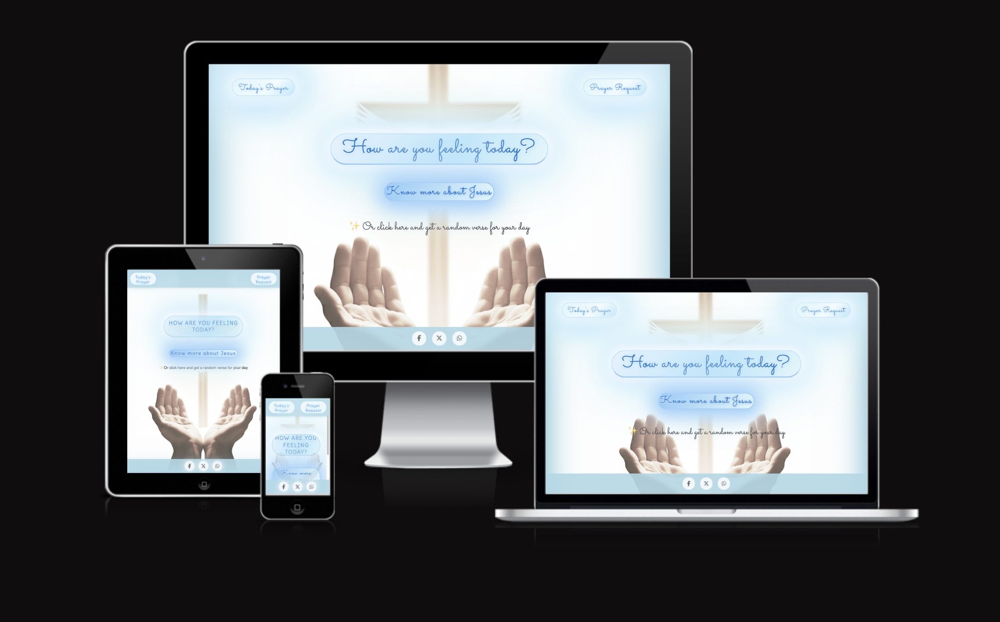
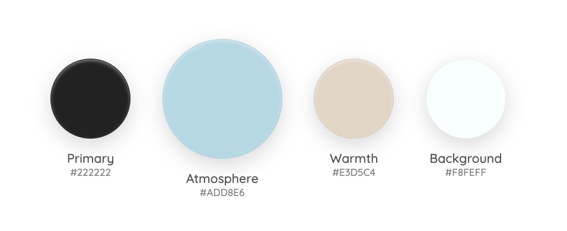
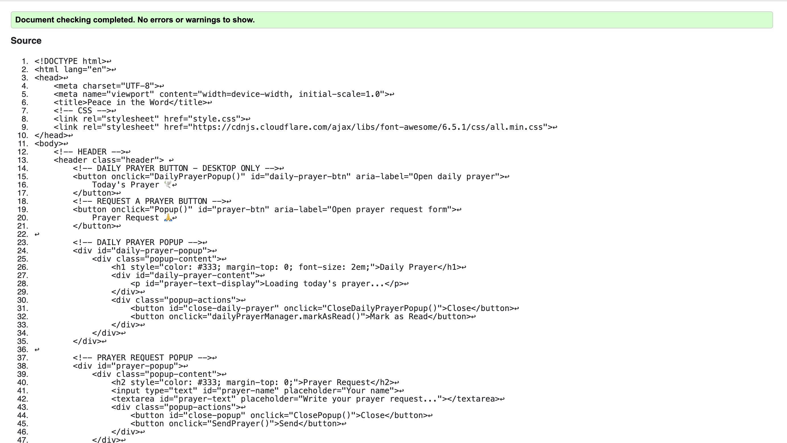
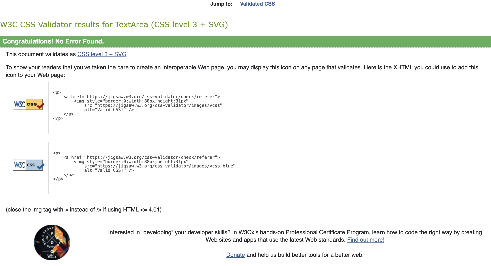
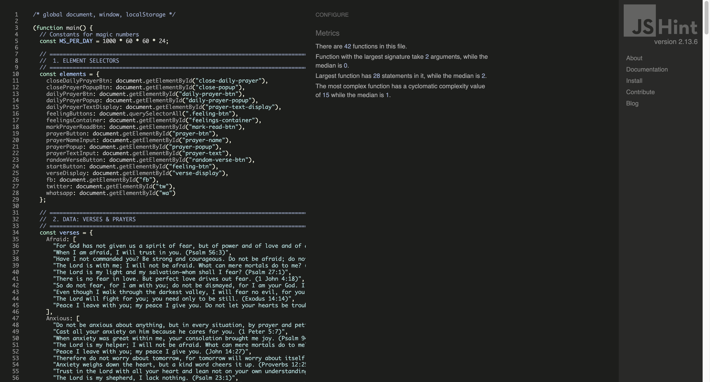

# The Word of God

This project was born from my personal faith in the Lord Jesus Christ and a calling on my heart to share the immense comfort and love His Word offers. More than just a website, "Peace in the Word" is my act of service to others—a digital sanctuary created so that anyone, in a moment of need, can find a word of hope.

My prayer is that, through this space, the love of Jesus may touch and console hearts, reminding everyone that they are not alone. To ensure this message is accessible to all, the site was built with a minimalist and fully responsive design.

👉 [View the live project here](https://oliveiracle.github.io/secondproject-the-word-of-god/)

---

## Table of Contents

- [Technologies Used](#technologies-used)
- [Features](#features)
- [Site Owner Goals](#site-owner-goals)
- [User Stories](#user-stories)
- [UX Design](#ux-design)
- [Testing](#testing)
- [Deployment](#deployment)
- [Bugs and Fixes](#bugs-and-fixes)
- [Credits](#credits)

---

## Technologies Used

- **HTML5**: For the core structure and content
- **CSS3**: For styling, responsive layout, animations, and dual-palette design
- **JavaScript (ES6)**: For interactivity, including verse display, pop-ups, and user events
- **Git & GitHub**: For version control and GitHub Pages hosting
- **VS Code**: Primary code editor

---

## Features

### Current Features

- **Emotion-Based Verse Discovery**: Click on feelings/emotions to receive relevant Biblical verses
- **Daily Prayer System**: Unique prayer for each day with localStorage tracking
- **Personal Prayer Requests**: Submit prayer intentions with name and message validation
- **Random Verse Generator**: Discover unexpected scripture passages
- **Social Sharing**: Share the website via Facebook, Twitter, and WhatsApp
- **Evangelistic Feature**: "Know more about Jesus" button with Gospel message
- **Responsive Design**: Mobile-first approach optimized for all devices
- **Background Music**: Gentle music plays automatically in the background when you open the site (the player is hidden and cannot be paused; the volume is set low for a subtle effect).

### Interactive Elements

- **Emotion-Based Navigation**: Button interface for discovering relevant verses
- **Modal Dialogs**: Clean popups for daily prayers, prayer requests, and Gospel message
- **Form Validation**: Input checking with user feedback for prayer submissions
- **Smooth User Flow**: Automatic scrolling and interface state management
- **Social Sharing Footer**: Persistent sharing options across all pages
- **Responsive Grid System**: Dynamic adaptation from desktop to mobile layouts

### Optional Enhancements

- **Web Share API**: Native sharing capabilities where supported
- **Local Storage**: Daily prayer progress tracking
- **CSS Animations**: Smooth UI transitions and hover effects

---

## Site Owner Goals

- **Provide spiritual comfort** by creating a space where users can access verses and prayers that bring peace
- **Offer personalized guidance** through verses tailored to the user's emotions
- **Encourage daily spiritual practice** with the "Today's Prayer" feature
- **Foster community and support** via the prayer request form
- **Make inspiration accessible** with the random verse generator
- **Share the Gospel** through the dedicated "Know more about Jesus" feature
- **Encourage sharing and growth** to help the message of hope reach more people

---

## User Stories

1. As a user feeling overwhelmed, I want to click the "How are you feeling today?" button so that I can see my emotional options.
2. As a user looking for comfort, I want to click on one of the emotion buttons so that a relevant Bible verse is displayed.
3. As a user wanting daily spiritual inspiration, I want to click the "Today's Prayer" button so that I can read a new prayer every day.
4. As a user seeking a random message of hope, I want to click the "Or get a random verse for your day" link so that a new verse is displayed.
5. As a user curious about faith, I want to click "Know more about Jesus" to learn about the Gospel.
6. As a user in need of spiritual support, I want to fill out and submit the prayer request form so that others can pray for me.

---

## UX Design

### The Psychology of Colors: An Ethereal Experience

The visual identity creates an uplifting spiritual experience that's functionally clear. It combines a celestial, calming atmosphere with a warm, human core.

**Celestial Atmosphere (Calming Blue):** A soft blue vignette on the edges and a solid blue footer create a soothing boundary. Interactive elements use the same blue for harmony, with "explosion of light" effects on clicks, evoking divine hope.

**Human Core (Warm Tones):** Background image with earthy tones (open hands, dove) at the center for warmth and connection. Dark text (#222, #333) ensures readability.

### Typography: A Balance of Personality and Clarity

**Headings (Sacramento):** A flowing, handwritten script that adds personality and a warm, welcoming touch to titles and key highlights.

**Body & UI (Delius):** A clean and friendly handwritten-style font, ensuring clarity and readability across all devices.

### Core Features & User Experience

- **Evangelistic Feature:** "Know more about Jesus" button opens Gospel modal – the mission's core
- **Interactive Verse Finder:** Main CTA leads to emotion grid for personalized verses
- **Daily Prayer Modal:** Unique daily prayer in a distraction-free window
- **Random Verse:** Spontaneous encouragement with a single click
- **Prayer Request Form:** Private space with validation and confirmation
- **Social Sharing:** Fixed footer for easy sharing and organic growth
- **Fully Responsive Design:** Mobile-first approach for universal accessibility

### Future Enhancements

- **Personal Verse Collection:** Save favorites via Local Storage
- **Secure Prayer Backend:** Storage for submissions and potential "Community Prayer Wall"
- **Daily Devotional Subscriptions:** Email or push notifications for prayers/verses

---

## Testing

### Manual Testing

- All links and buttons were tested to ensure correct functionality
- Prayer request form tested with both valid and invalid inputs
- Verses and prayers display correctly across all devices
- Popups tested to open and close without issues
- Layout tested on Chrome, Safari, Brave, and mobile devices

### Validator Testing

To ensure the highest quality, the project's code and performance were rigorously tested using official industry-standard tools.

**HTML:** Passed W3C Validator with no errors  

**CSS:** Passed Jigsaw Validator with no errors  

**JavaScript:** Passed JSHint with no significant errors  

| Feature | Action | Expected Result |
| --- | --- | --- |
| Main CTA | Click "How are you feeling today?" button | The feelings selection grid appears, and the main button becomes inactive |
| Feelings Buttons | Click on any feeling button (e.g., "Peaceful") | The feelings grid disappears, and a relevant Bible verse is displayed and centered on the screen |
| Random Verse Link | Click "Or get a random verse for your day" | A random verse from any category is displayed and centered on the screen |
| Know Jesus Button | Click "Know more about Jesus" button | A modal window appears with Gospel information. The close button functions correctly |
| Daily Prayer | Click "Today's Prayer" button | A modal window appears with the daily prayer. The "Close" and "Mark as Read" buttons function correctly |
| Prayer Request | Click "Prayer Request" button | A modal window with a form appears. The form validates input and shows a confirmation upon sending |
| Social Sharing | Click on Facebook, X, or WhatsApp icons | A new tab opens with the corresponding social media sharing dialogue pre-populated with the site's link |
| Responsiveness | Resize the browser window from desktop to mobile size | The layout adjusts smoothly, with elements stacking correctly and the feelings grid changing to a 2-column layout |

### Lighthouse Audit

Audits via Chrome DevTools show excellence in performance, accessibility, and best practices.

#### Desktop Audit Results

| Category | Score |
| --- | --- |
| Performance | **99** |
| Accessibility | **91** |
| Best Practices | **100** |
| SEO | **100** |

#### Mobile Audit Results

| Category | Score |
| --- | --- |
| Performance | **99** |
| Accessibility | **100** |
| Best Practices | **100** |
| SEO | **100** |

---

## Deployment

The site was deployed using **GitHub Pages**:

1. Go to the repository on GitHub.
2. Click on the **Settings** tab.
3. Scroll down to **Pages**.
4. Under **Source**, select the `main` branch and set folder to `/ (root)`.
5. Save, and GitHub will provide a deployment link.

👉 [Live Project: The Word of God](https://oliveiracle.github.io/secondproject-the-word-of-god/)

---

## Bugs and Fixes

| Bug | Description | Fix |
| --- | --- | --- |
| Responsive Layout Inconsistency | Feelings grid displayed in single column on mobile instead of intended 2-column layout | Refactored JS to use `classList.toggle()` with `.is-visible` class; CSS media queries handle 2-column grid layout |
| Unresponsive Main CTA | Main button became unclickable after verse display on desktop | Updated `toggleFeelingsContainer()` to reset UI state: `verseDisplay.style.display = 'none'` |
| Content Overlap on Mobile | Main content scrolled under fixed header causing visual overlap | Added `padding-top` matching header height in mobile media query to create safe area |
| Off-screen Verse Display | Selected verses appeared off-screen on mobile, requiring manual scrolling | Added `scrollIntoView({ behavior: 'smooth', block: 'center' })` to verse display functions |

No major unresolved bugs remain in the current version.

---

## Credits

### Concept & Content

- **Core Vision:** Personal vision to create a digital sanctuary of hope inspired by Christian faith
- **Biblical Verses:** Holy Bible (New International Version)
- **Daily Prayers:** Inspired by online devotionals and personally written content
- **Gospel Content:** Traditional Christian Gospel message for the "Know Jesus" feature

### Media

- **Background Imagery:** Composite created from royalty-free Pexels resources
- **Icons:** Sourced from Emojipedia for UI elements and social sharing
- **Background Music:**  
    - Track: "Come Jesus"  
    - File: `assets/images/audio/music.mp3`
    - Source: [Come Jesus on Pixabay Music](https://pixabay.com/music/main-title-come-jesus-13760/)  
    - License: Free for commercial and non-commercial use, no attribution required (Pixabay License)

### Development, Tools & Acknowledgements

- **Google AI (Gemini):** UX brainstorming, CSS/JS debugging, and professional documentation assistance
- **GitHub Copilot:** Real-time code completion and CSS structuring
- **Stack Overflow & MDN Web Docs:** References for JavaScript event handling and DOM manipulation
- **Prettier:** Code formatting extension for consistent, readable codebase
- **Code Institute:** Foundational learning structure and web development best practices

### Attribution

All code from external sources is properly attributed via comments in the source code. The majority of the codebase was written specifically for this project, with external libraries and frameworks clearly identified where used.

---

> **Note:** This project was developed for educational purposes only and is not intended for commercial use.

---

*Built with faith, hope, and love. May this project continue to glorify Jesus and bless lives.* 🙏
