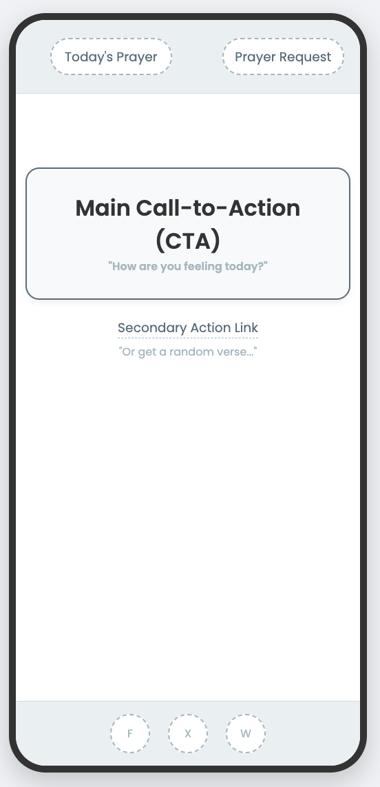
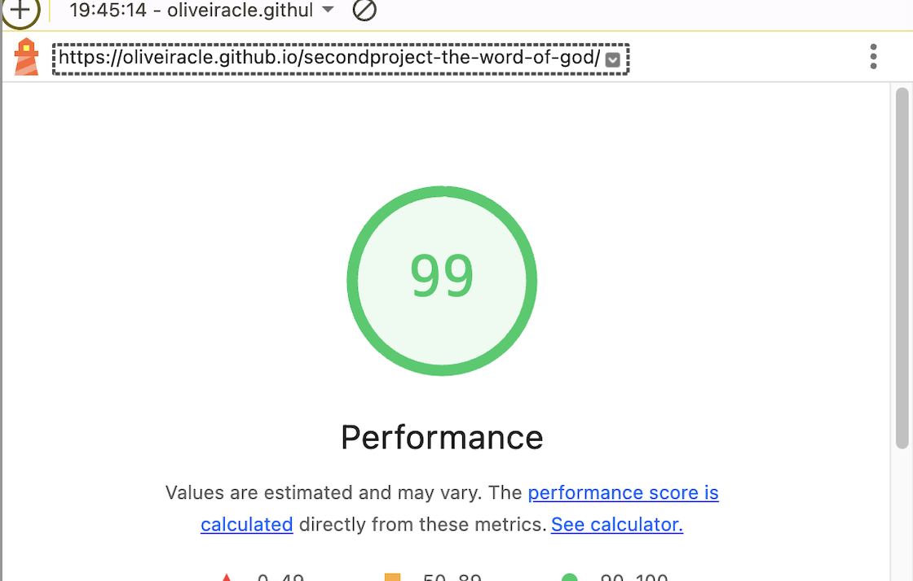
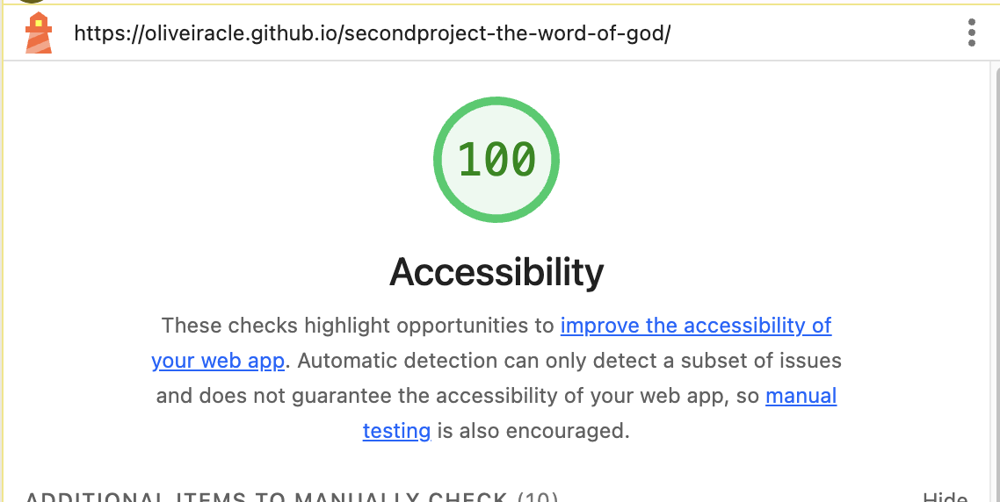
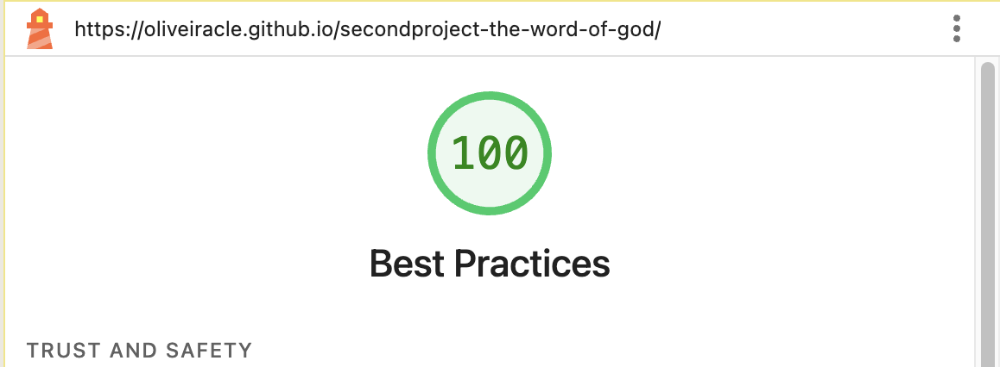
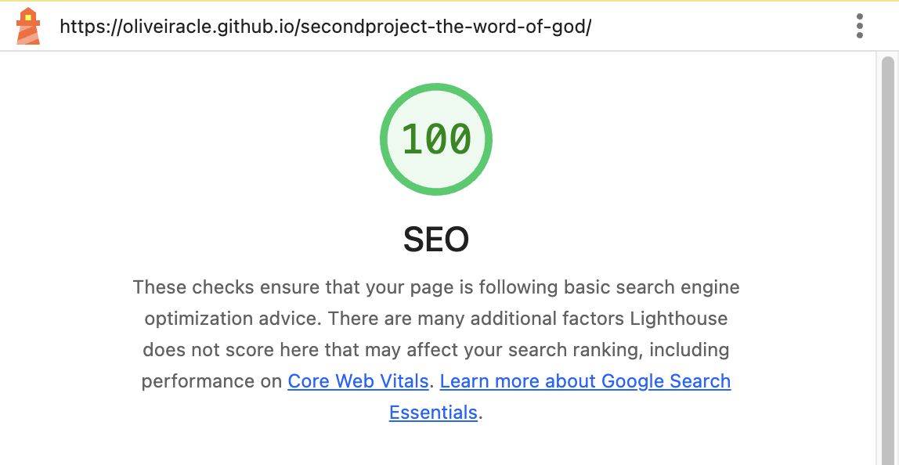

# The Word of God

This project was born from my personal faith in the Lord Jesus Christ and a calling on my heart to share the immense comfort and love His Word offers. More than just a website, "Peace in the Word" is my act of service to others—a digital sanctuary created so that anyone, in a moment of need, can find a word of hope.

My prayer is that, through this space, the love of Jesus may touch and console hearts, reminding everyone that they are not alone. To ensure this message is accessible to all, the site was built with a minimalist and fully responsive design.

    Screenshot showing site responsiveness 

👉 [View the live project here](https://oliveiracle.github.io/secondproject-the-word-of-god/)

---

## Technologies Used

HTML5: For the core structure and content of the application.

CSS3: For all styling, including the responsive layout, animations, and the dual-palette design strategy.

JavaScript (ES6): For all interactivity, including the logic for displaying verses, managing pop-ups, and handling user events.

Git & GitHub: For version control and hosting the deployed project via GitHub Pages.

VS Code: As the primary code editor for development.

---

## Site Owner Goals
- **Provide spiritual comfort** by creating a space where users can access verses and prayers that bring peace.  
- **Offer personalized guidance** through verses tailored to the user’s emotions.  
- **Encourage daily spiritual practice** with the *“Today’s Prayer”* feature.  
- **Foster community and support** via the prayer request form.  
- **Make inspiration accessible** with the random verse generator. 
- **Encourage Sharing and Growth** to help the message of hope reach more people, the site includes simple and accessible sharing options, fostering organic community growth. 

---

## User Stories

1. As a user feeling overwhelmed, I want to click the *“How are you feeling today?”* button, so that I can see my emotional options.  
2. As a user looking for a word of comfort, I want to click on one of the emotion buttons, so that a relevant Bible verse is displayed.  
3. As a user who wants daily spiritual inspiration, I want to click the *“Today’s Prayer”* button, so that I can read a new prayer every day.  
4. As a user who wants a random message of hope, I want to click the *“Or get a random verse for your day”* link, so that a new verse is displayed.  
5. As a user in need of spiritual support, I want to fill out and submit the prayer request form, so that others can pray for me.  

---

## UX Design

#### The Psychology of Colors: An Ethereal Experience

The visual identity of the project is designed to create an experience that is both spiritually uplifting and functionally clear. The strategy combines a celestial, calming atmosphere with a warm, human core at its center.

1. The Celestial Atmosphere (The Calming Blue)

The entire user experience is enveloped in a soft, light blue. This is not just an accent color, but the primary atmospheric element of the site.

**The Ethereal Frame:** A gentle blue vignette on the edges of the screen and a solid blue footer create a soothing visual boundary. This "celestial frame" removes outside distractions and immerses the user in a space of peace and serenity.

**The Unifying Element:** This same lightblue is used for all interactive elements (buttons, links, pop-ups), creating a seamless and harmonious connection between the atmosphere and the user interface.

**Interactive Light:** To enhance the ethereal feeling, interactive elements respond to the user's touch with a soft "explosion of light" effect. This micro-interaction reinforces the theme of hope and divine inspiration, making every click feel meaningful.

2. The Human Core (The Heart of the Site)

Resting at the heart of this blue atmosphere is the background image, rich in soft, warm, and earthy tones.

**Warmth and Humanity:** The natural beiges of the open hands and the gentle whites of the dove provide a focal point of warmth, comfort, and human connection.

**Clarity and Readability:** Floating above this, the dark tones (#222 and #333) are used for all text, ensuring the message is always solid, timeless, and easy to read.

This combination ensures that the user feels enveloped in a peaceful, heavenly calm (from the blue atmosphere) while connecting with a message of hope and humanity at its core.

### Typography: A Balance of Personality and Clarity

The typographic strategy was designed to be warm and engaging, balancing a personal, handwritten font with a clean, modern sans-serif for optimal readability. This pairing creates a clear hierarchy and guides the user through a friendly and accessible experience.

- **Heading Font (Gloria Hallelujah):** *The Personal Touch.* Used for main titles to create a human and friendly connection. Its handwritten style brings warmth and an inviting personality to the forefront.

- **Body Font (Quicksand):** *The Foundation of Clarity.* Chosen for all body text, menus, and buttons to ensure a comfortable and highly readable experience on any device. Its clean, modern aesthetic complements the heading font without competing for attention.

- **Accent Font (Leckerli One):** *The Elegant Signature.* Reserved for key brand elements like the logo or special call-to-actions. It adds a touch of sophistication and reinforces a unique, memorable brand identity.  
 
### Wireframes & User Flow

To ensure an intuitive and serene user experience, a series of wireframes were designed to map out the core user journey. The focus was on creating a minimalist layout that guides the user gently, eliminating distractions and focusing on the main purpose of the application.

### Desktop Wireframes

#### Step 1: The Home Page 
The main goal of the home page is to welcome the user in a calm and focused environment, immediately presenting the central purpose of the site. The layout is intentionally simple and centered around four key interactions.

1. Main Call-to-Action (CTA): The user's journey is initiated by a single, clear call-to-action ("How are you feeling today?"). This is the primary path.

2. Secondary Navigation: Essential but non-critical options ("Today's Prayer" and "Prayer Request") are placed at the corners to be accessible but not distracting.

3. Alternative Path: A secondary, less prominent link ("Or get a random verse") offers a direct alternative for users who don't wish to follow the main flow.

4. Fixed Share Component: A fixed footer remains visible at the bottom of the screen. It contains social media share buttons, providing a constant but unobtrusive encouragement for users to share the site with others.

5.  Persistent Share Footer: The fixed footer with the share buttons for Facebook, X (Twitter), and WhatsApp remains visible at the bottom of the screen. This ensures that the option to share the site is always available, even as the user navigates through the main flow.

This initial screen is designed to be a peaceful entry point, leading the user seamlessly to the next step while also facilitating the site's organic growth through sharing.

#### Step 2: Feelings Selection Screen

After the user clicks the main call-to-action on the home page, the interface transitions to reveal the feelings selection screen. The goal of this step is to present a clear and accessible grid of options that allows the user to easily identify and select their current emotional state.

The layout is designed to guide the user through this selection process smoothly:

1. Inactive CTA: The main call-to-action remains on screen but is visually de-emphasized. This maintains context, showing the user the origin of their current step without being an active element.

2. Feelings Grid: This is the primary interaction area. A structured grid of buttons is displayed, each representing a different feeling. This layout allows for quick scanning and easy comparison of the available options.

3. Verse Display Placeholder: A dedicated area is shown at the bottom of the screen. This placeholder clearly communicates to the user where the result of their selection (the verse) will appear, setting expectations for the next and final step of the flow.

#### Step 3: The Daily Prayer Popup
This flow is triggered when the user clicks on the "Today's Prayer" navigation button from the main screen. The goal is to present the prayer in a focused, immersive environment without navigating away from the home page.

The decision to use a popup modal is strategic. It creates a focused environment by using a blurred overlay to remove all other distractions, allowing the user to concentrate solely on the prayer. This approach also preserves the user's context, as they can easily return to the main interface without losing their place.

1. The popup's layout is structured for simplicity and function:

2. Clear Title: Immediately identifies the purpose of the popup.

3. Content Block: A well-defined and readable text area for the prayer.

4. Action Buttons: Two buttons with distinct purposes:

5. Primary Action ("Mark as Read"): Provides a sense of completion for the user.

6. Secondary Action ("Close"): Offers a simple and universal way to dismiss the modal.

This interaction provides a moment of reflection before the user seamlessly returns to the main flow.

#### Step 4: The Prayer Request Popup
This flow is initiated when the user clicks on the "Prayer Request" navigation button. The goal is to provide a simple, private, and accessible way for users to submit a prayer request without disrupting their main experience.

Using a popup modal for this feature is a deliberate choice. It provides a focused and distraction-free interface for form submission, ensuring user privacy and concentration. Once the interaction is complete, the user is returned seamlessly to the home page.

The form's layout is designed for clarity and ease of use:

1. Clear Title: The title "Prayer Request" immediately clarifies the purpose of the modal.

2. Minimalist Form: Two straightforward input fields ("Your name" and "Write your prayer request...") make the submission process quick and intuitive.

3. Distinct Actions: The buttons are clearly defined:

4. Primary Action ("Send"): The main goal of the form, visually emphasized.

5. Secondary Action ("Close"): Allows the user to easily cancel the action without any friction.

This feature is designed to foster a sense of community and support in a seamless and respectful manner.

### Mobile Wireframes
For mobile devices, the design was adapted to a single-column layout to ensure a clean, focused, and user-friendly experience on smaller screens. The priority is to maintain the same serene atmosphere while making all interactions easily accessible with one hand.

#### Step 5: The Home Page 
On mobile devices, after the user interacts with the main CTA, the interface transitions to display the feelings selection screen. The layout is adapted into a touch-friendly, two-column grid to ensure all options are easily scannable and selectable with one hand.

Key adaptations for the mobile layout include:

1. Optimized Navigation: The two main navigation buttons ("Today's Prayer" and "Prayer Request") are positioned at the top of the screen, providing immediate access without cluttering the primary interaction area.

2. Prominent CTA: The main call-to-action remains the central focus, enlarged to be easily tappable and immediately draw the user's attention.

3. Vertical Hierarchy: All elements are arranged in a clear vertical hierarchy, guiding the user's eye downwards from the navigation options to the primary and secondary actions, ensuring a seamless experience.
This approach ensures that the application is just as powerful and easy to use on a mobile device as it is on a desktop.

4. Persistent Share Footer: The fixed footer with the share buttons for Facebook, X (Twitter), and WhatsApp remains visible at the bottom of the screen. This ensures that the option to share the site is always available, even as the user navigates through the main flow.

#### Step 6: Feelings Selection Screen 

On mobile devices, after the user taps the main CTA, the interface transitions to the feelings selection screen. The layout is adapted into a two-column grid, optimized for vertical scrolling and easy tapping on a smaller screen.

The design strategy for this screen focuses on maintaining clarity and usability:

1. Vertical Flow: The layout encourages a natural downward scroll, allowing the user to browse the full list of feelings comfortably.

3. Touch-Friendly Buttons: Each button is designed with ample spacing and a large tappable area, ensuring an error-free selection process.

4. Persistent Context: The inactive CTA remains visible at the top. This reminds the user of the action that led them here and maintains a consistent visual anchor throughout the flow.

#### Step 7: The Daily Prayer Pop-up
 
This wireframe details the interaction of the Daily Prayer popup on mobile devices. The experience has been optimized to maintain the user's full focus by adapting the modal's design for vertical screens and touch-based interactions.

Key optimizations for the mobile popup experience include:

1. Focused Overlay: The popup uses an overlay that darkens the background, eliminating distractions and centering the user's attention exclusively on the prayer's content—an even more critical approach on smaller screens.

2. Readable and Tappable Layout: The content is presented in an easy-to-read text block, and the action buttons are large and well-spaced to ensure that the interaction is simple and accessible by touch.

3. Clear Action Hierarchy: The two actions ("Mark as Read" and "Close") maintain a clear visual hierarchy, with the primary action having more emphasis to intuitively guide the user to complete or dismiss the interaction.

#### Step 7: The Prayer Request Pop-up

This wireframe details the "Prayer Request" form on mobile devices. The primary goal is to ensure the process of submitting a request is simple, private, and effortless, adapting the form's layout for a seamless touch-based experience.

The mobile adaptation focuses on clarity and ease of use:

1. Distraction-Free Form: The modal overlay provides a private and focused environment, allowing the user to write their request without any distractions from the main page.

2. Optimized for Touch: The input fields and text area are large and have ample spacing, making them easy to tap and type on a mobile screen.

3. Clear and Simple Actions: The"Send" and "Close" buttons are designed to be easily accessible, with a clear visual hierarchy that guides the user toward the primary action of submitting the form.

4. A fixed footer provides a constant and accessible way for users to share the website. It contains clean icons for sharing on Facebook, X (Twitter), and WhatsApp. The component is designed to be unobtrusive, ensuring it doesn't interrupt the user's peaceful experience. This feature encourages organic community growth by making it effortless to share the message of hope.

---

#### Core Features & User Experience
This project is designed to be more than a simple website; it's an interactive spiritual sanctuary. Every feature was crafted to be intuitive, serene, and focused on providing comfort and inspiration.

##### Interactive Verse Finder
The core experience begins with a single, welcoming call-to-action: “How are you feeling today?”. This leads the user to an interactive grid of feelings, where they can select an emotion to receive a tailored Bible verse, offering personalized guidance and comfort.

##### Daily Prayer Modal
To encourage a daily moment of reflection, the site presents a unique prayer each day in a focused, distraction-free modal window. This feature invites users to return and start their day with a moment of peace.

##### Spontaneous Inspiration
For users seeking a quick word of encouragement, the "Random Verse" option provides a spontaneous Bible verse without the need to navigate through the feelings grid.

##### Prayer Request Form
A safe and private space where users can submit their personal prayer requests through a simple and elegant form. A confirmation message assures the user that their request has been received.

##### Seamless Social Sharing
A fixed footer provides a constant but unobtrusive way to share the website on Facebook, X (Twitter), and WhatsApp. This feature was designed to help grow the community organically by making it effortless for users to share this sanctuary with others.

##### Fully Responsive Design
The entire experience is seamlessly adapted for all screen sizes, from mobile phones to desktops. The mobile-first approach ensures that the site is beautiful, functional, and accessible to everyone, everywhere.

### The Vision: Future Enhancements

#### Personal Verse Collection: 
To deepen the user's personal connection with the Word, a future update will allow them to "favorite" and save verses. This will create a personal, persistent collection that can be revisited anytime for encouragement and reflection.

#### Secure Prayer Backend: 
To enhance the prayer request feature, a secure backend will be implemented to store submissions. This paves the way for a potential future feature: an anonymous "Community Prayer Wall" where users can feel the support of a praying community.

#### Daily Devotional Subscriptions: 
To help users build a consistent spiritual habit, a subscription feature (via email or push notifications) will be developed. Users will be able to opt-in to receive the "Daily Prayer" or a verse directly on their device, bringing a moment of peace to their daily routine. 

---

## Testing

### Manual Testing 
- All links and buttons were tested to ensure correct functionality.  
- Prayer request form tested with both valid and invalid inputs.  
- Verses and prayers display correctly across all devices.  
- Popups tested to open and close without issues.  
- Layout tested on Chrome, Safari, and mobile devices.  

## Validator Testing
To ensure the highest quality, the project's code and performance were rigorously tested using official industry-standard tools.

**HTML Validation:** The HTML code was passed through the official W3C Validator.

**Result**: Passed with no errors or significant warnings.

**CSS Validation:** The CSS code was passed through the official Jigsaw CSS Validator.

**Result:** Passed with no errors found.

**JavaScript Linting:** The JavaScript code was analyzed using JSHint to check for syntax errors and potential issues.

**Result:** Passed with no significant errors or warnings detected.

| Feature | Action | Expected Result |
| --- | --- | --- |
| Main CTA | Click "How are you feeling today?" button. | The feelings selection grid appears, and the main button becomes inactive. |
| Feelings Buttons | Click on any feeling button (e.g., "Peaceful"). | The feelings grid disappears, and a relevant Bible verse is displayed and centered on the screen. |
| Random Verse Link | Click "Or get a random verse for your day". | A random verse from any category is displayed and centered on the screen. |
| Daily Prayer | Click "Today's Prayer" button. | A modal window appears with the daily prayer. The "Close" and "Mark as Read" buttons function correctly. |
| Prayer Request | Click "Prayer Request" button. | A modal window with a form appears. The form validates input and shows a confirmation upon sending. |
| Social Sharing | Click on Facebook, X, or WhatsApp icons. | A new tab opens with the corresponding social media sharing dialogue pre-populated with the site's link. |
| Responsiveness | Resize the browser window from desktop to mobile size. | The layout adjusts smoothly, with elements stacking correctly and the feelings grid changing from flex to a 2-column grid. |

---

### Lighthouse Audit

To ensure the highest quality, the project was audited using **Lighthouse** in Chrome DevTools to evaluate its performance, accessibility, and overall user experience. The project achieved excellent scores across the board, demonstrating a commitment to modern web standards and a high-quality experience for all users.

#### **Desktop Audit Results**

The desktop version was tested to ensure a fast, accessible, and reliable experience on larger screens.

| Category | Score |
| :--- | :--- |
| Performance | **99** |
| Accessibility | **91** |
| Best Practices | **100** |
| SEO | **100** |

Click to view Desktop Lighthouse Report

 

#### **Mobile Audit Results**

The mobile version was tested to confirm a seamless and optimized experience, achieving perfect or near-perfect scores in all categories.

| Category | Score |
| :--- | :--- |
| Performance | **99** |
| Accessibility | **100** |
| Best Practices | **100** |
| SEO | **100** |

Click to view Mobile Lighthouse Report

### Deployment
The site was deployed using **GitHub Pages**:  

1. Go to the repository on GitHub.  
2. Click on the **Settings** tab.  
3. Scroll down to **Pages**.  
4. Under **Source**, select the `main` branch and set folder to `/ (root)`.  
5. Save, and GitHub will provide a deployment link.  

👉 Live Project: [The Word of God](https://oliveiracle.github.io/secondproject-the-word-of-god/)  

---

### Credits

**Concept & Content**

**Core Vision:** The entire project, from its spiritual mission to its final visual identity, was born from a personal vision to create a serene and hopeful digital sanctuary.

**Biblical Verses:** All scripture quoted in this project is from the Holy Bible (New International Version).

**Daily Prayers:** The daily prayers were inspired by various online devotionals and personally written to align with the project's comforting and uplifting tone.

### Media

**Background Imagery:**
 The atmospheric background image is a composite created and adapted from royalty-free resources on Pexels.

**Icons:** All icons used for the social sharing features and UI elements are from Emojipedia.

### Development, Tools & Acknowledgements

**Google AI (Gemini):** Served as an invaluable partner throughout the development lifecycle. Gemini was instrumental in:

Brainstorming UX strategies and professional phrasing for all documentation.

Creating the detailed wireframes and design boards.

Debugging complex CSS layout issues and refactoring JavaScript for better performance and stability.

Acting as a language translator to ensure all documentation met a professional English standard.

### Code & Logic

**GitHub Copilot:**
 Provided real-time code completion and assisted in structuring the CSS file within VS Code.

**Stack Overflow & MDN Web Docs:** Served as essential resources for researching and implementing JavaScript solutions for event handling and DOM manipulation.

### Code Quality & Formatting

**Prettier:** The Prettier extension for VS Code was used to automatically format all code, ensuring a clean, consistent, and readable codebase.

**Code Institute:** A special thanks to the Code Institute for providing the project's foundational learning structure and recommended practices.
  
---
